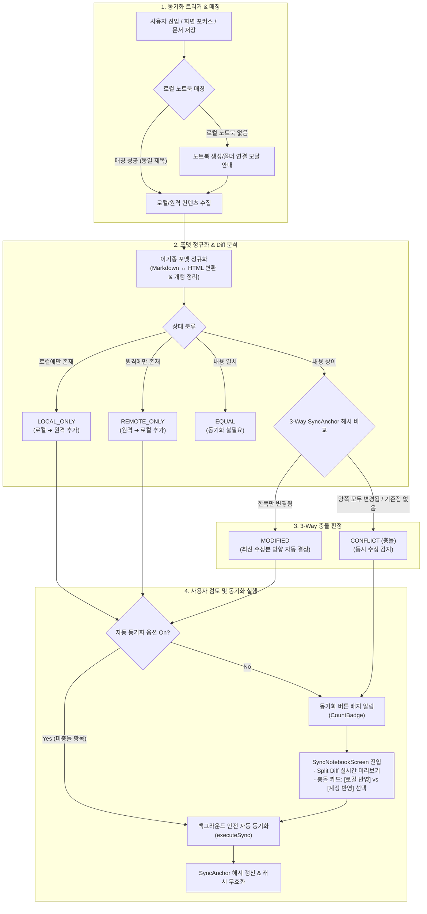

# 2601. 로컬-계정 간 노트북 스마트 동기화 및 3-Way 충돌 해결 아키텍처

## Context and Problem Statement

`blacktokki-notebook`은 네트워크 연결 없이도 안전하게 지식을 기록할 수 있는 오프라인 우선(Offline-First) 로컬 계정과, 여러 기기 간 데이터 공유 및 백업을 제공하는 온라인 내 계정을 모두 지원합니다([ADR-2503](2503-offline-first-local-account.md)).

* **로컬 계정의 저장 방식**: 브라우저의 원천 파일시스템(OPFS / File System Access API)을 통해 사용자의 실제 PC 로컬 폴더에 마크다운(`.md`) 파일 및 칸반/스크럼 보드 설정(`.json`) 파일로 직접 저장됩니다.
* **내 계정(온라인)의 저장 방식**: 중앙 서버 데이터베이스에 저장되며, 웹 에디터 표준인 HTML/리치텍스트 형식 및 구조화된 엔티티로 관리됩니다.

사용자는 비행기나 네트워크가 불안정한 환경에서는 로컬 환경에서 자유롭게 노트를 작성하고, 온라인 상태가 되었을 때 로컬 파일과 원격 계정 데이터를 상호 동기화(양방향 동기화)하여 최신 상태를 유지하고자 합니다. 그러나 이 둘을 동기화하는 과정에서 다음과 같은 아키텍처적 도전 과제들이 존재합니다:

1. **식별자 체계의 상이성 (노트북 매칭 문제)**:
   로컬 스토리지(로컬 폴더 경로)와 서버 데이터베이스(정수형 기본키 ID)의 식별 체계가 완전히 분리되어 있어, 어떤 로컬 노트북과 원격 노트북이 같은 대상인지 1:1로 정확하게 매칭하고 연결해 줄 기준이 필요합니다.
2. **저장 포맷의 이기종성 (마크다운 파일 ↔ 서버 HTML/DB)**:
   로컬 파일은 마크다운 텍스트(`.md`)이고 서버는 HTML 형식입니다. 단순한 바이트 단위 비교나 단순 문자열 일치 검사로는 실질적인 내용이 같은지 다른지 판별할 수 없습니다.
3. **동시 편집 시의 조용한 데이터 유실 (Silent Overwrite / 충돌)**:
   사용자가 오프라인 상태에서 로컬 파일을 수정하고, 동시에 모바일이나 다른 웹 브라우저에서 동일한 원격 노트를 수정한 경우, 단순 최종 수정 시각(Last-Modified-Wins)만으로 자동 덮어쓰기를 수행하면 둘 중 한쪽의 소중한 작업 내용이 아무 경고 없이 영구히 소실됩니다.
4. **사용자 편의성과 데이터 안전성의 딜레마**:
   단 하나의 오탈자 수정까지 매번 사용자가 수동으로 동기화 화면에 진입하여 diff를 확인하도록 강제하면 사용성이 크게 저하됩니다. 반대로 모든 것을 무조건 자동 동기화하면 동시 수정 시 데이터가 덮어써지는 심각한 사고로 이어집니다.

따라서 **노트북 자동 매칭, 이기종 포맷 간의 정규화 비교, 3-Way 기준점을 활용한 안전한 충돌 감지, 시각적 Split Diff 검토 UI, 그리고 미충돌 항목에 대한 백그라운드 자동 동기화가 유기적으로 결합된 포괄적 스마트 동기화 아키텍처**를 수립해야 합니다.

---

## Decision

로컬 파일시스템과 원격 계정 간의 데이터를 안전하고 편리하게 동기화하기 위해, **"5단계 동기화 파이프라인 (매칭 ➔ 정규화/Diff ➔ 3-Way 충돌 감지 ➔ 시각적 검토 ➔ 안전한 자동 반영)"** 아키텍처를 채택합니다.

### 1. 노트북 자동 매칭 및 로컬 폴더 연동 (`useNotebookSync.ts`)

* **제목 기반 1:1 매칭**: 원격 노트북의 제목(대소문자 무시, 앞뒤 공백 제거)과 일치하는 로컬 노트북을 자동으로 탐색하여 매칭합니다.
* **로컬 노트북 미존재/삭제 시의 상태 격리 및 비활성화 (`!matchedLocalNotebook`)**:
  로컬에 동일한 이름의 노트북이 없거나 사용자가 로컬 노트북을 삭제한 경우, 계정 노트를 임의의 신규 생성 대상(`REMOTE_ONLY`)으로 잘못 수집하지 않고 즉시 `diffItems: []`, `diffCount: 0`을 반환합니다. 이를 통해 불필요한 배지 표시를 차단하고 동기화 실행 버튼을 비활성화(`syncDisabled: true`)합니다.
* **로컬 폴더 미연결 시 부드러운 생성 안내 (`isLocalNotebookMissing`)**:
  원격에는 노트북이 있지만 로컬에 아직 대응하는 노트북(폴더)이 없는 경우, 동기화 화면 상단 배너의 `[로컬 노트북 생성 및 폴더 연결]` 버튼을 명시적으로 눌렀을 때만 `UsageModeModal`을 호출하여 실제 PC 저장 폴더를 선택하도록 안내합니다. 폴더 지정이 완료되면 후속 동기화가 자연스럽게 이어집니다.
* **노트북 삭제 시 동기화 기준점(`SyncAnchor`) 정리**:
  로컬 또는 원격 노트북 삭제 시 해당 노트북에 영속화된 3-Way 동기화 기준점(`deleteSyncAnchor`)을 즉시 제거하고 `notebookSyncDiff` 캐시를 무효화하여 이전 동기화 데이터의 잔존을 방지합니다.

### 2. 저장소 포맷 정규화 및 Diff 비교 파이프라인

로컬과 원격의 포맷 불일치를 해결하기 위해 다음과 같은 양방향 정규화 및 내용 비교 메커니즘을 적용합니다:

* **노트(`.md`) 정규화**:
  * 로컬의 마크다운 텍스트와 원격의 HTML 데이터를 각각 `toMarkdown` 유틸리티를 통해 동일한 마크다운 규격으로 변환합니다.
  * 운영체제 간 개행 문자 차이(`\r\n` ➔ `\n`) 및 앞뒤 공백을 정규화한 후 실질적인 텍스트 동등성(`isContentEqual`)을 검사합니다.
* **보드(`.json`) 동등성 비교**:
  * 칸반 및 스크럼 보드 설정 데이터는 JSON 문자열 파싱 후 객체 필드 단위로 동등성을 검사합니다.
* **비교 결과 4가지 상태 분류 (`SyncDiffStatus`)**:
  * `LOCAL_ONLY`: 로컬 파일시스템에만 새로 추가된 문서 (기본 동작: 로컬 ➔ 원격 생성)
  * `REMOTE_ONLY`: 원격 계정에만 새로 추가된 문서 (기본 동작: 원격 ➔ 로컬 생성)
  * `MODIFIED`: 양쪽에 모두 존재하며 한쪽만 수정된 문서 (기본 동작: 최신 수정본 반영)
  * `CONFLICT`: 양쪽에 모두 존재하며 양쪽에서 동시에 수정된 문서 (기본 동작: 사용자 선택 필수)

### 3. 3-Way 해시 기준점(`SyncAnchor`) 기반 스마트 충돌 감지

단순한 시스템 시계(타임스탬프)는 기기 간 시계 오차(Clock Skew)나 파일 수정 시간 보존 오류로 인해 쉽게 왜곡됩니다. 따라서 이전 동기화 시점의 공통 조상(Base) 데이터를 기억하는 **3-Way 해시 기준점 방식**을 채택합니다.

1. **기준점(`SyncAnchor`) 영속화**:
   * 동기화가 성공적으로 완료될 때마다, 각 노트 및 보드의 정규화된 텍스트로부터 32-bit FNV 해시를 생성하여 `AsyncStorage`(`@blacktokki:notebook:sync_anchor:${userId}:${notebookTitle}`)에 안전하게 보관합니다.
2. **3-Way 판정 매트릭스**:

| 로컬 상태 (`localHash === anchor.hash`) | 원격 상태 (`remoteHash === anchor.hash`) | 최종 판정 (`status`) | 동기화 동작 |
| :---: | :---: | :---: | :--- |
| **일치** (로컬 미변경) | **일치** (원격 미변경) | `EQUAL` | 변경 없음 (동기화 목록 제외) |
| **불일치** (로컬만 수정됨) | **일치** (원격 미변경) | `MODIFIED` | **로컬 ➔ 원격** 안전 반영 (미충돌 자동 동기화 가능) |
| **일치** (로컬 미변경) | **불일치** (원격만 수정됨) | `MODIFIED` | **원격 ➔ 로컬** 안전 반영 (미충돌 자동 동기화 가능) |
| **불일치** (로컬 수정됨) | **불일치** (원격도 수정됨) | **`CONFLICT`** | **동시 수정 감지!** 자동 덮어쓰기 차단 및 사용자 선택 요구 |
| *기준점 없음(최초 동기화)* | *내용 불일치* | **`CONFLICT`** | **안전 우선**: 초기 기준점이 없을 때 내용이 다르면 충돌로 간주 |

### 4. 시각적 Diff 프리뷰 및 충돌 해결 UI (`SyncNotebookScreen.tsx`)

* **좌우 Split Diff 시각화**:
  기존의 공통 컴포넌트인 `MoveChangedPreview`를 재사용하여, 어떤 문단과 단어가 추가·삭제되었는지 시각적인 Diff 블록으로 투명하게 확인합니다.
* **독립된 충돌 전용 선택 카드**:
  `MoveChangedPreview`를 침투적으로 변경하지 않고, 화면 상단에 각 충돌 노트별 전용 카드를 독립 렌더링합니다.
  * `[ (●) 💻 로컬 계정 반영 ]` vs `[ ( ) ☁️ 내 계정 반영 ]` 양자택일 버튼 제공
  * 타임스탬프를 비교하여 더 최근에 수정된 쪽에 `(최신)` 힌트 배지 표시
  * 버튼을 클릭하면 하단의 Split Diff 프리뷰가 실시간으로 연동되어 즉시 미리보기 방향이 반전됩니다.
* **보드(`.json`) 데이터 처리**:
  사용자 인지 과부하를 막기 위해 보드 JSON은 시각적 텍스트 diff 목록에서는 제외하고, 동기화 실행 시 최신 설정으로 함께 동기화됩니다.

### 5. 안전한 백그라운드 자동 동기화 (Auto-Sync)

* **미충돌 항목 한정 자동 동기화 (`autoSyncNonConflicted`)**:
  충돌이 발생하지 않은 안전한 항목(신규 작성된 노트, 단방향으로만 수정된 노트/보드)은 사용자가 매번 화면을 열지 않아도 백그라운드에서 조용히 자동 동기화됩니다.
* **충돌 항목 보존 및 배지 알림**:
  충돌이 감지된 항목은 절대 자동으로 덮어쓰지 않고 보존하며, Drawer 및 탐색 메뉴의 동기화 버튼에 미해결 항목 수 배지(`CountBadge`)를 띄워 사용자의 확인을 유도합니다.
* **무한 루프 원천 차단 (`runningSyncNotebookIds`, `isAutoSyncingRef`)**:
  전역 Set 및 뮤테이션 가드를 두어 동기화 작업이 진행 중일 때 추가 동기화가 중복 실행되는 것을 막고, 동기화 완료 후 해시 기준점이 갱신되어 다음 diff 검사 시 변경 목록에서 빠져나오므로 루프가 자연스럽게 종료됩니다.
* **실시간 변경 감지 연동**:
  React Query 캐시 이벤트(`pageContents`, `boardContents` 업데이트) 및 윈도우 포커스 이벤트를 감지하여 항상 최신 차이점을 유지합니다.

---

## Non-goals

* **Git 스타일의 인라인 텍스트 줄 단위 자동 병합(Auto-Merge) 미채택**:
  문서 내 서로 다른 문단을 편집했을 때 텍스트 단위로 자동 병합하는 방식은 마크다운 문법(테이블, 코드 블록, 목록 구조)을 깨뜨릴 위험이 매우 크고, 복잡한 충돌 마커(`<<<<<<< HEAD`)를 모바일 화면에서 다루기 어렵기 때문에 채택하지 않습니다.
* **일괄 강제 덮어쓰기 및 사본 파일 무차별 생성 배제**:
  모든 문서를 무조건 한쪽으로 일괄 덮어쓰거나 매 충돌마다 `노트 (1).md` 식의 복제본 파일을 마구 생성하는 방식은 사용자의 파일 관리 부담을 가중시키므로 지양합니다.

---

## Consequences

### Good (긍정적 효과)

* **완벽한 데이터 무결성 보장**: 3-Way 해시 기준점을 통해 동시 편집 충돌을 100% 감지하므로, 사용자의 소중한 기록이 의도치 않게 조용히 덮어써지는 데이터 유실 사고가 완전히 사라집니다.
* **직관적인 투명성 제공**: 사용자는 Split Diff를 통해 무엇이 어떻게 변경되었는지 눈으로 직접 확인하고, 충돌 발생 시에도 카드 버튼 클릭 한 번으로 원하는 버전을 쉽게 선택할 수 있습니다.
* **높은 일상적 사용 편의성**: 일반적인 단방향 편집 시에는 백그라운드 자동 동기화가 안전하게 처리해주므로, 매번 수동으로 동기화 버튼을 누르는 번거로움이 해소됩니다.
* **클린 아키텍처 및 공통 컴포넌트 순수성 유지**: 기존 이동/복사 화면(`MovePageScreen`)에서 공유하던 컴포넌트(`MoveChangedPreview`)에 전용 prop을 강제 주입하지 않고 충돌 카드를 화면 내에 격리하여 재사용성과 유지보수성을 극대화했습니다.

### Bad (트레이드오프 및 관리 요소)

* **기준점 저장 I/O 비용**: 동기화 완료 시점마다 항목별 최신 해시를 `AsyncStorage`에 저장해야 합니다. (단, 일반적인 수백 개 노트 규모에서는 수 밀리초 내외로 성능 영향 미미)
* **충돌 시 사용자 확인 개입**: 양쪽 동시 수정이 일어난 노트는 자동 해결되지 않으므로 사용자가 동기화 화면에 방문하여 어느 버전을 살릴지 1회 선택해야 합니다.

---

## Implementation Plan

### Affected Paths

* **상태 및 타입 정의**: `apps/notebook/src/features/sync/types.ts` (`SyncDiffItem`, `SyncAnchor`, `SyncOptions` 등)
* **동기화 파이프라인 훅**: `apps/notebook/src/features/sync/useNotebookSync.ts` (매칭, 정규화, 3-Way 해시 판정, 자동 동기화 뮤테이션)
* **동기화 UI 화면**: `apps/notebook/src/features/sync/SyncNotebookScreen.tsx` (Split Diff 미리보기, 충돌 양자택일 카드, 옵션 스위치)
* **진입점 및 네비게이션**: `apps/notebook/src/features/sync/SyncButton.tsx`, `apps/notebook/src/features/index.tsx`
* **다국어 및 문서**:
  * `apps/notebook/src/lang/ko.json`
  * `apps/notebook/public/사용 방법.md`, `dist/사용 방법.md`
  * `apps/notebook/public/Usage.md`, `dist/Usage.md`

### Patterns to Follow

* **개행 및 공백 정규화**: 해시 계산 및 텍스트 비교 전 반드시 `trim().replace(/\r\n/g, '\n')`를 거쳐 플랫폼 간 줄바꿈 차이로 인한 거짓 충돌을 방지합니다.
* **스토리지 키 구획화**: 사용자 ID와 노트북 제목을 결합한 고유 키(`@blacktokki:notebook:sync_anchor:${userId}:${notebookTitle}`)로 기준점을 격리합니다.
* **동시 실행 방지 락**: `runningSyncNotebookIds` 전역 Set과 `isAutoSyncingRef`를 사용하여 동일 노트북에 대한 중복 동기화 API 호출을 차단합니다.
* **실시간 UI 연동**: 충돌 카드의 선택 상태 변경 시 상위 상태(`conflictChoices`)를 갱신하여 하단 `MoveChangedPreview`의 diff 소스/타겟이 즉시 리렌더링되도록 구성합니다.

### Patterns to Avoid

* ❌ 다른 화면과 공유하는 공통 컴포넌트(`MoveChangedPreview`, `ChangedBlock`)에 동기화 화면 전용 prop을 주입하여 결합도를 높이지 않습니다.
* ❌ 충돌이 발생한 노트를 임의의 타임스탬프 기준으로 사용자 허락 없이 자동 덮어쓰지 않습니다.
* ❌ 단일 애플리케이션(`apps/notebook`) 수정 시 루트 `yarn build`를 실행하지 않습니다 (`AGENTS.md` 규칙 준수).

### Verification

- [x] **정적 분석**: TypeScript 컴파일 검사 통과 (`node node_modules/typescript/bin/tsc --project apps/notebook/tsconfig.json --noEmit`)
- [x] **린트 검사**: ESLint 검사 통과 (`npx eslint apps/notebook/src/features/sync --fix`)
- [x] **노트북 매칭 및 생성 연동**: 로컬 노트북 미존재 시 `UsageModeModal`이 정상 호출되고 폴더 연동 후 동기화로 복귀되는지 확인
- [x] **3-Way 충돌 탐지**: 양쪽 동시 수정 시 `status: 'CONFLICT'`로 정확하게 분류되고 동기화 버튼에 배지가 표시되는지 확인
- [x] **충돌 양자택일 UI**: 충돌 카드에서 로컬/원격 반영 선택 시 하단 Split Diff의 방향과 본문이 실시간으로 전환되는지 확인
- [x] **안전 자동 동기화**: `autoSyncNonConflicted` 활성화 시 충돌 항목을 제외한 신규/단방향 수정 항목만 백그라운드에서 안전하게 자동 동기화되고 루프가 발생하지 않는지 확인
- [x] **사용자 가이드 반영**: `사용 방법.md` 및 `Usage.md`에 전체 동기화 파이프라인과 충돌 해결 안내가 누락 없이 최신화되었는지 확인

---

## Alternatives Considered

### 옵션 1: 단순 최종 수정 시각 기준 자동 덮어쓰기 (Last-Modified-Wins)
* **내용**: 충돌 여부를 검사하지 않고, 타임스탬프가 더 최근인 쪽의 내용으로 상대방을 무조건 덮어씁니다.
* **기각 사유**: 기기 간 시계 오차(Clock Skew)가 빈번하며, 오프라인 작업 중 다른 곳에서 수정된 데이터가 아무런 알림 없이 조용히 영구 소실되므로 기각했습니다.

### 옵션 2: Git 방식의 인라인 텍스트 자동 병합 (Auto-Merge)
* **내용**: 3-Way diff를 통해 서로 다른 문단을 수정한 경우 사용자의 개입 없이 텍스트를 인라인으로 자동 합칩니다.
* **기각 사유**: 일반 텍스트와 달리 마크다운 문법 구조(표, 인용문, 코드 블록) 및 보드 JSON 형식이 손상될 위험이 매우 크고, 모바일 터치 환경에서 복잡한 인라인 충돌 마커를 편집하는 경험이 매우 조악하여 기각했습니다.

### 옵션 3: 모든 변경사항 무조건 수동 동기화
* **내용**: 자동 동기화 없이 모든 변경 사항을 항상 동기화 화면에서 사용자가 직접 눈으로 보고 버튼을 눌러야만 반영합니다.
* **기각 사유**: 데이터는 안전하지만, 단 한 글자의 사소한 수정에도 매번 동기화 화면을 방문해야 하므로 사용자의 피로도가 극심하여 기각했습니다.

---

## More Information

### 관련 소스 코드
* [types.ts](../../apps/notebook/src/features/sync/types.ts): 동기화 데이터 타입 및 옵션 인터페이스
* [useNotebookSync.ts](../../apps/notebook/src/features/sync/useNotebookSync.ts): 매칭, 정규화, 3-Way 판정, 자동 동기화 핵심 로직
* [SyncNotebookScreen.tsx](../../apps/notebook/src/features/sync/SyncNotebookScreen.tsx): Split Diff 및 충돌 카드 선택 UI
* [SyncButton.tsx](../../apps/notebook/src/features/sync/SyncButton.tsx): 동기화 상태 배지 표시 및 모달 트리거
* [MovePageScreen.tsx](../../apps/notebook/src/screens/main/MovePageScreen.tsx): 재사용되는 Split Diff 프리뷰 컴포넌트

### 관련 ADR
* [ADR-2503: 로컬 계정 지원 및 오프라인 우선(Offline-First) 하이브리드 인증](2503-offline-first-local-account.md)
* [ADR-2504: 모듈성 확보를 위한 플러그인/확장기능(Extension) 아키텍처](2504-plugin-extension-architecture.md)
* [ADR-2507: 노트 태그 기반 칸반/스크럼 보드 아키텍처](2507-tag-based-kanban-scrum-board.md)

